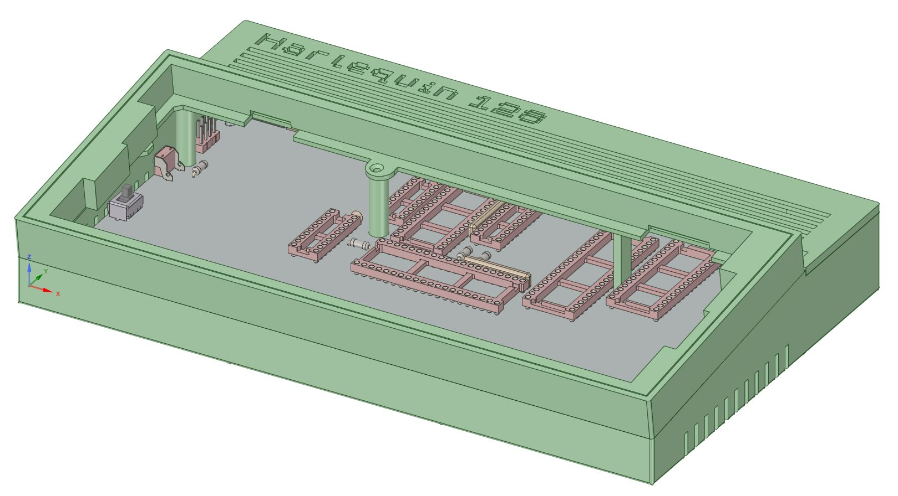
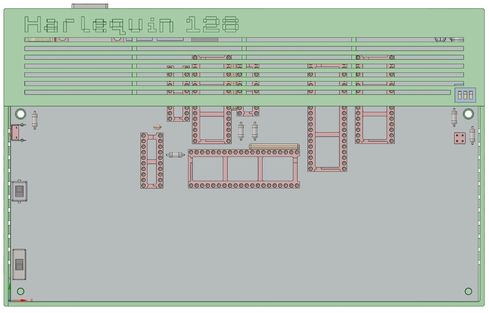
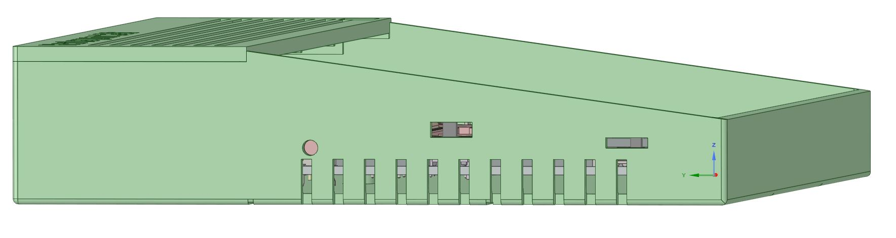
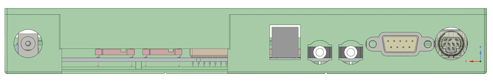

This should fit both an issue 4A and issue 4B board. I do not have a copy of this board yet to fully test fit, so this is based on a model I made from the gerbers Don graciously provided. If you do end up printing a copy, would love to hear how it turned out.

Since the board inserts from the back at an angle, you can't use switches that protrude on the left side so the following substituions need to be made with the original BOM.

| Switch   | Original          | Substitute                    |
| -------- | ----------------- | ----------------------------- |
| Reset    | TE 2-1825027-0    | TE 1825027-2                  |
| Timing   | E-Switch EG2208   | E-Switch EG2207               |
| NTSC/PAL | Nidec MFS401N-2-Z | None needed, already vertical |

You will need to use a small tool to manipulate the side switches and ROM dipswitches which are also exposed through the top cover.

All ports are exposed on the back.  The audio jack cut out should be large enough to support either the three pin or four pin (with video) options.  The DB9 to DIN-9 spacing is tight so I'm not entirely happy with no wall there, but in my testing with various DIN cables and DSUB jacks on the cases I have built, you pretty much need all that clearance so it is what it is.

