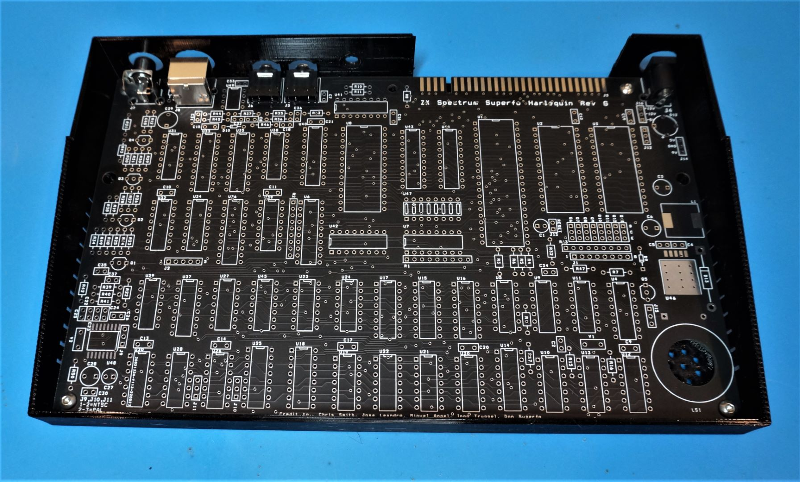
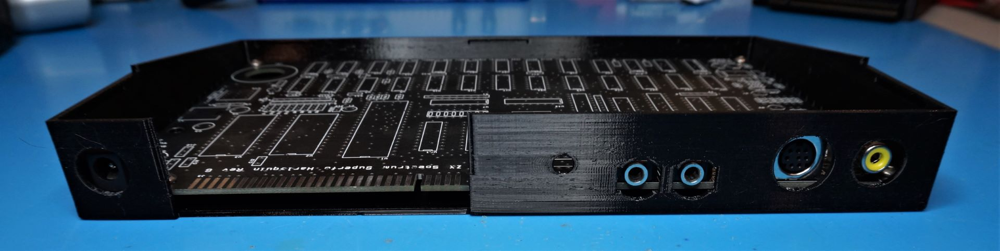

No introduction needed.  I haven't fully built mine yet, but have printed a test copy of the base and everything looks good from a fit up standpoint.

The rear panel includes a hole to mount a 5mm push button reset switch.

https://www.aliexpress.us/item/2255799950576497.html

