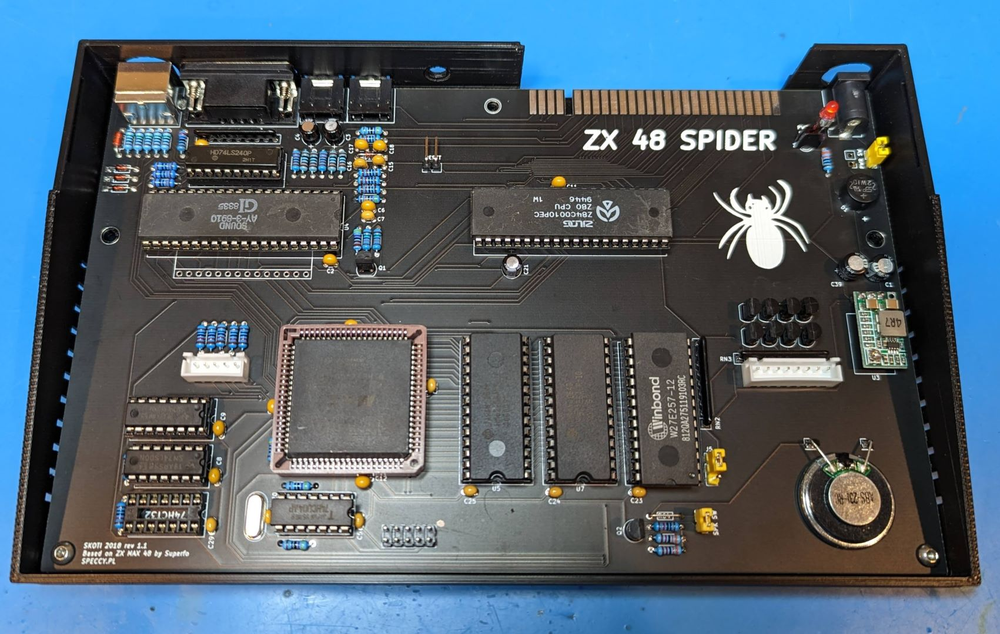
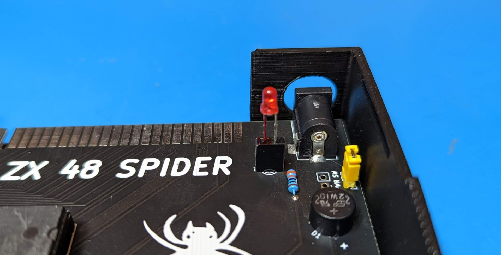

Nice clone based on Superfo's ZX Max 48 design available from

https://github.com/konkotgit/ZX-48-Spider

Easy build with support for both AY sound and a Kempston joystick port on board.  Not a lot of info on US boards and groups, but a long discussion thread with the creator on 

https://www.speccy.pl/forum/index.php?topic=5716.0

A standard 3mm LED did not reach through the top of the cover so I mounted it in a 2.54mm 2p female header and cut the legs down a bit until I got the right height.  The red Sharpie on the socket and legs are to mark which leg is postive since they are now both the same length.

The read panel includes a hole to mount a 5mm push button reset switch.

https://www.aliexpress.us/item/2255799950576497.html

